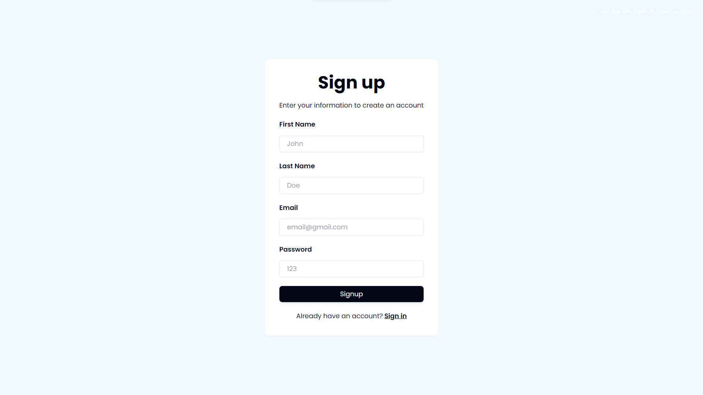
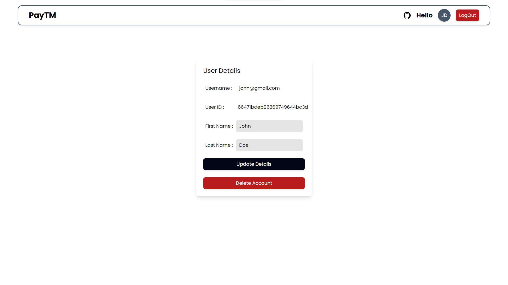

# Project to build a simple PayTM like App

## Deployed Live on 🚀:
### Frontend : Vercel -> https://zipmoney.vercel.app/signin
### Backend : Render -> https://week-4-paytm-mern.onrender.com/api/v1/user

## Tech Stack : 💻
#### Backend -> TypeScript, Express, JWT 
#### Database -> MongoDB, Mongoose
#### Frontend -> TypeScript, React, Tailwind

## Tests Done (POSTMAN and FRONTEND) : ✅ 👍

- successfull backend integration
- most errors handled (frontend/backend)

- auth: 
    - creates new users on signup with a random balance bw 1-10000
    - keeps them logged in until they want to logout on all pages
    - throws error if they are not logged in
    - logout feature deletes access token and signs them out

- navigation: 
    - all pages navigate between them successfully
    - all pages work as expected
    - payment feature works as expected
    - user data updates successfully
    - user data and account connected gets deleted on account deletion
    - money transfer feature deducts correct user's balance and adds to correct user's account

## Details of Things learnt/covered : 🎊

- Backend :
    - typescript express server
    - users table and accounts table in mongoDB using mongoose orm
    - zod validation for all necessary routes
    - auth routes : 
        - POST "api/v1/user/signup", with assigning user with random balance under 10000 
        - POST "api/v1/user/signin", with jwt token return
    - user routes : 
        - GET "api/v1/user/" , fetching current user information (username, firstname, lastname)
        - PUT "api/v1/user/" , updating their information (firstname, lastname, password with encryption)
        - GET "api/v1/user/bulk", searching for users with or without filter query
    - account routes :
        - GET "api/v1/account/balance", to get their balance
        - POST "api/v1/account/transfer", to transfer money to a another user

- Frontend :
    - typescript vite react - tailwind stack
    - auth pages : 
        - "/signup", stores jwt token and redirects to dashboard 
        - "/signin", stores jwt token and redirects to dashboard
    - user pages : 
        - "/dashboard" , shows available users except the current logged in user
        - "/user" , allows users to see their username(email), userid, and editable firstname, lastname fields to update their information. Also allows a delete account option
        - "/send", to transfer money to a another user

## Some screenshots: 📷

1. Signup page

2. Signin page

3. Dashboard page

4. User Page

5. Send Page

## Bugs : ❌
- UX related: 
    - search feature works but is case sensitive [fix would require a little structural change with mongo schema and stuff]
    - landing on any random page does not redirect to a working url ex the root url

<!-- ## Run : 🚀 -->
<!-- - Create .env in root folder and set the environment variables JWT_SECRET and MONGO_URL
- Run <code> node index.js </code> in root folder -->

