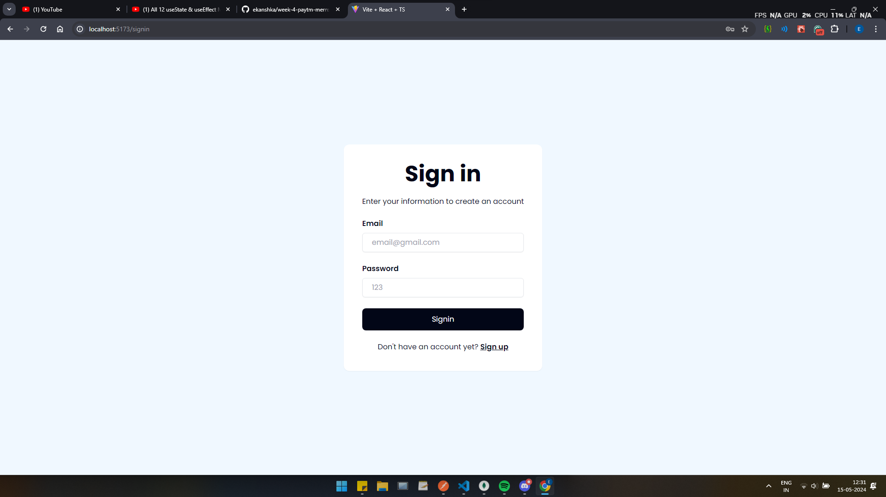
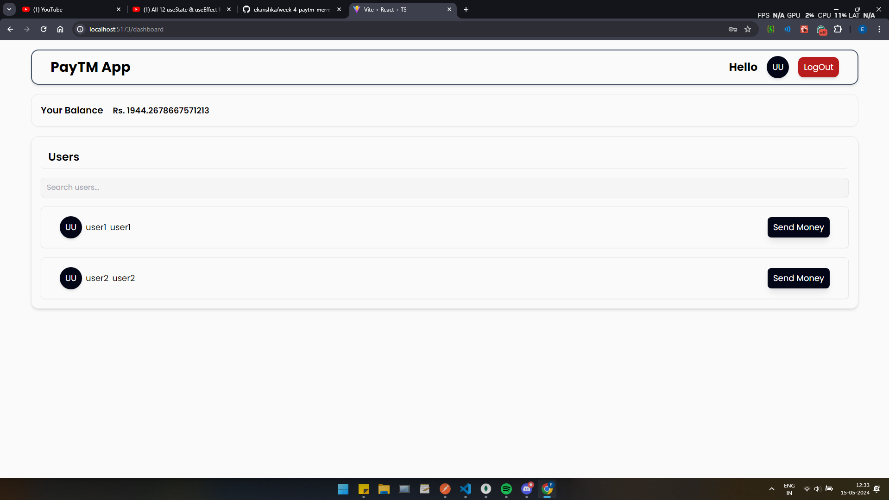

# Project to build a simple PayTM like App

<!-- ## Deployed Live on 🚀: -->
<!-- ### Frontend : Vercel -> https://week-3-todo-app-mern.vercel.app/
### Backend : Render -> https://week-3-todo-app-mern.onrender.com/todos -->

## Tech Stack : 💻
#### - Backend -> TypeScript, Express, JWT 
#### - Database -> MongoDB, Mongoose
#### - Frontend -> TypeScript, React, Tailwind

<!-- ## Tests Done (POSTMAN and FRONTEND) : ✅ 👍 -->
<!-- - successfully creates new todos
- open routes/no authentication
- mark as done capability
- all synchronous backend with frontend -->

## Details of Things learnt/covered : 🎊

- Backend :
    - typescript express server
    - users table and accounts table in mongoDB using mongoose orm
    - zod validation for all necessary routes
    - auth routes : 
        - POST "api/v1/user/signup", with assigning user with random balance under 10000 
        - POST "api/v1/user/signin", with jwt token return
    - user routes : 
        - GET "api/v1/user/" , fetching current user information (username, firstname, lastname)
        - PUT "api/v1/user/" , updating their information (firstname, lastname, password with encryption)
        - GET "api/v1/user/bulk", searching for users with or without filter query
    - account routes :
        - GET "api/v1/account/balance", to get their balance
        - POST "api/v1/account/transfer", to transfer money to a another user

- Frontend :
    - typescript vite react - tailwind stack
    - users table and accounts table in mongoDB using mongoose orm
    - zod validation for all necessary routes
    - auth routes : 
        - POST "/user/signup", with assigning user with random balance under 10000 
        - POST "/user/signin", with jwt token return
    - user routes : 
        - GET "/user/" , fetching current user information (username, firstname, lastname)
        - PUT "/user/" , updating their information (firstname, lastname, password with encryption)
        - GET "/user/bulk", searching for users with or without filter query
    - account routes :
        - GET "/account/balance", to get their balance
        - POST "/account/transfer", to transfer money to a another user

Some screenshots:

1. Signup page

2. Signin page

3. Dashboard page

<!-- ## Bugs : ❌ -->
<!-- - no bugs recorded for the required functioning -->

<!-- ## Run : 🚀 -->
<!-- - Create .env in root folder and set the environment variables JWT_SECRET and MONGO_URL
- Run <code> node index.js </code> in root folder -->

